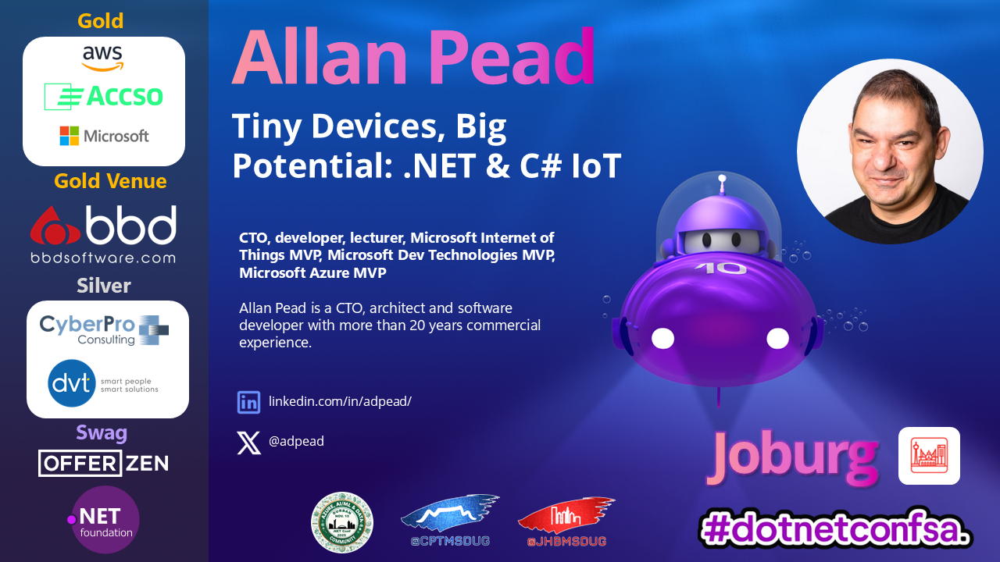

# 🚀 Tiny Devices, Big Potential: .NET & C# IoT



## .NET Conf 2025 Community Edition - South Africa

> **.NET: It's everywhere you want to be** — from the cloud, to your desktop, to your phone, web, and yes... even nestled inside your smart toaster! 🍞

This repository contains the demonstration projects from the session **"Tiny Devices, Big Potential: .NET & C# IoT"** presented at .NET Conf 2025 Community Edition South Africa.

---

## 📖 Session Overview

In this session, we explored the fascinating world of the Internet of Things (IoT) with .NET and C#, focusing on microcomputers, single-board computers, and microcontrollers. 

**With .NET nanoFramework, we boldly went where only 64 kilobytes of memory are enough** — right into the heart of microcontrollers! This session demonstrated how .NET's superpowers are transforming even the most resource-constrained edge devices, proving once and for all that **size doesn't matter when you have .NET on your side!**

---

## 🔗 Quick Start Resources

- **[Getting Started with .NET](https://learn.microsoft.com/en-us/dotnet/standard/get-started)**
- **[Getting Started with .NET nanoFramework](https://docs.nanoframework.net/content/getting-started-guides/getting-started-managed.html)**
- **[Getting Started with AWS IoT](https://docs.aws.amazon.com/iot/latest/developerguide/iot-gs.html)**
- **[Getting Started with Azure IoT](https://learn.microsoft.com/en-us/azure/iot/)**

---

## 🎯 What is .NET nanoFramework?

[.NET nanoFramework](https://www.nanoframework.net/) is a free and Open Source platform that enables the writing of managed code applications for constrained embedded devices. It's perfect for:

- **Microcontrollers** with as little as 64KB of RAM
- **IoT edge devices** requiring real-time responses
- **Resource-constrained environments** where traditional .NET wouldn't fit
- Developers who want to use **C# and .NET** instead of C/C++ for embedded development

---

## 🔧 Projects in This Repository

### 1️⃣ **ESP32-CAM Sample Projects** 📷
**Location:** `nfesp32camsample/`

A comprehensive suite of three projects demonstrating different approaches to working with the ESP32-CAM module using .NET nanoFramework.

#### **What You'll Learn:**
- Capturing images with the ESP32-CAM OV2640 sensor
- Saving photos to SD cards
- Uploading images to a .NET Web API
- Real-time MJPEG video streaming (15-30 FPS!)
- Hardware JPEG encoding with zero CPU overhead

#### **Projects Include:**
- 🗂️ **NfEsp32CamSample** - SD card photo storage
- 🌐 **NfEsp32CamApiSample** - Upload photos to Web API
- 📹 **NfEsp32CamJpegStream** - Real-time MJPEG streaming

#### **Hardware:**
- ESP32-CAM module with OV2640 sensor

#### **Cool Factor:**
Stream live video from a low cost microcontroller using C# — all with hardware-accelerated JPEG encoding!

#### **Setup Instructions:**

##### ESP32-CAM nanoFramework Firmware

Custom nanoFramework firmware for ESP32-CAM (AI-Thinker) with camera and SD card support.

> **📢 COMING SOON TO OFFICIAL NANOFRAMEWORK**  
> This custom firmware is being merged into the official .NET nanoFramework project and will be available through the standard nanoff tool in an upcoming release.

> **⚠️ EDUCATIONAL USE ONLY**  
> This firmware and documentation are provided for educational and learning purposes only. Use at your own risk.

##### Features

- ✅ ESP32 camera support (OV2640 sensor)
- ✅ PSRAM support (2MB allocated for framebuffers)
- ✅ WiFi and networking

##### Hardware Requirements

- ESP32-CAM AI-Thinker board
- USB-to-Serial adapter (FTDI, CP2102, etc.) for flashing
- USB cable

##### Prerequisites

**Install .NET nanoFramework Flash Tool:**

```bash
dotnet tool install -g nanoff
```

If already installed, update to latest version:
```bash
dotnet tool update -g nanoff
```

**Install Visual Studio 2022 with .NET nanoFramework Extension:**

1. Install Visual Studio 2022 (Community Edition or higher)
2. In Visual Studio, go to Extensions → Manage Extensions
3. Search for ".NET nanoFramework"
4. Install the extension and restart Visual Studio

##### Flashing Firmware to ESP32-CAM

**Windows:**

1. **Connect ESP32-CAM to PC**
   - Connect ESP32-CAM to USB-to-Serial adapter:
     - ESP32-CAM GND → Adapter GND
     - ESP32-CAM 5V → Adapter 5V (or 3.3V if no 5V available)
     - ESP32-CAM U0R (GPIO3) → Adapter TX
     - ESP32-CAM U0T (GPIO1) → Adapter RX
     - ESP32-CAM IO0 → GND (for programming mode)
   - Connect adapter to PC USB port

2. **Find COM Port**
   - Open Device Manager
   - Look under "Ports (COM & LPT)"
   - Note the COM port number (e.g., COM5)

3. **Flash Firmware**
   
   Run the flash script with your COM port:
   ```cmd
   cd firmware
   flash.bat COM5
   ```
   Replace `COM5` with your actual COM port.

4. **Disconnect IO0 from GND and press RESET button**

##### Verifying Installation

1. **In Visual Studio:**
   - Go to View → Other Windows → Device Explorer
   - You should see "ESP32_CAM_PSRAM" device listed
   - Click to connect

2. **Check Device Information:**
   - In Device Explorer, right-click device → Device Capabilities
   - Should show firmware version and available APIs

##### Running the Sample Application

**Prerequisites:**

1. Have nanoFramework.Hardware.Esp32.Camera library available

**Setup:**

See the [samples documentation](nfesp32camsample/sample/README.md) for detailed setup and usage instructions.

##### Camera Configuration

The default configuration uses these pins (ESP32-CAM AI-Thinker standard):

```csharp
CameraConfig.CreateDefault() returns:
- PWDN: GPIO32
- RESET: GPIO-1 (not used)
- XCLK: GPIO0
- SIOD (SDA): GPIO26
- SIOC (SCL): GPIO27
- Data pins: D7=GPIO35, D6=GPIO34, D5=GPIO39, D4=GPIO36, 
             D3=GPIO21, D2=GPIO19, D1=GPIO18, D0=GPIO5
- VSYNC: GPIO25
- HREF: GPIO23
- PCLK: GPIO22
- XCLK Frequency: 20 MHz
- Pixel Format: JPEG
- Frame Size: SVGA (800x600)
- JPEG Quality: 12 (lower = better quality, range 0-63)
- Frame Buffers: 1
```

**Customizing Camera Settings:**

```csharp
var config = CameraConfig.CreateDefault();
config.frameSize = (int)FrameSize.VGA;     // 640x480
config.jpegQuality = 10;                    // Better quality
config.fbCount = 2;                         // Double buffering

camera.Initialize(config);
```

Available frame sizes: QVGA, VGA, SVGA, XGA, SXGA, UXGA

##### Troubleshooting

**Firmware Won't Flash:**
- Ensure IO0 is connected to GND during power-on
- Try lower baud rate: `--baud 115200` instead of 921600
- Check USB cable and connections
- Try different USB port

**"Device not found" in Visual Studio:**
- Disconnect and reconnect ESP32-CAM
- Press RESET button on ESP32-CAM
- Check COM port in Device Manager
- Ensure firmware was flashed successfully

**Camera Initialization Fails:**
- Check camera ribbon cable is properly connected
- Verify PSRAM is working (some ESP32-CAM boards have bad PSRAM)
- Power supply must provide stable 5V with sufficient current (500mA+)

**SD Card Mount Fails:**
- Ensure SD card is formatted as FAT32
- Check card is not write-protected
- Use smaller SD cards (≤32GB) for better compatibility
- Try reformatting card
- Some SD cards are incompatible - try a different card

**Deployment Hangs on "Connecting to debugger":**
- Press RESET button on ESP32-CAM
- Disconnect and reconnect device
- Power supply must provide stable 5V with sufficient current (500mA+)

##### Support

For issues with:
- **nanoFramework:** https://github.com/nanoframework/Home/discussions
- **ESP32-CAM Hardware:** ESP32-CAM community forums
- **Camera library:** nanoFramework camera library repository

##### Credits

Built with:
- nanoFramework v1.0
- ESP-IDF v5.4.2
- esp32-camera component
- FatFS for SD card support

---

### 2️⃣ **M5Stack Grower - Smart Plant Monitor** 🌱
**Location:** `m5stackgrower/`

An IoT sustainability project that monitors soil moisture and environmental conditions, with MQTT integration for home automation.

#### **What You'll Learn:**
- Reading analog sensors (soil moisture) via ADC
- Controlling relays for automated watering
- MQTT pub/sub for IoT messaging
- WiFi connectivity with nanoFramework
- Real-time display on M5Stack screen
- JSON deserialization for sensor data
- Integration with Tasmota devices

#### **Features:**
- 💧 Real-time soil moisture monitoring
- 🌡️ Environmental data display (temperature, humidity, pressure, light, air quality)
- 💡 Remote light control via MQTT
- 🔄 Automated relay control for plant watering
- 📊 Beautiful color-coded console display

#### **Hardware:**
- M5Stack Core (ESP32-based)
- DFRobot Capacitive Soil Moisture Sensor
- DFRobot Relay Module
- Connected to MQTT broker for home automation

#### **MQTT Integration:**
- Subscribes to environmental sensor data
- Publishes commands to Sonoff/Tasmota smart devices
- Displays real-time environmental readings from remote sensors

---

### 3️⃣ **MXCHIP AZ3166 IoT DevKit** 🎛️
**Location:** `nanoaz3166/`

A demonstration of sensor fusion on the MXCHIP AZ3166 IoT development board with integrated OLED display and multiple environmental sensors.

#### **What You'll Learn:**
- I2C communication with multiple sensors
- Sensor fusion (combining data from different sensors)
- OLED display control (SSD1306)
- GPIO button handling with debouncing
- Working with multiple sensor libraries
- Display mode toggling and user interaction

#### **Features:**
- 🌡️ **Temperature & Humidity** sensing (HTS221)
- 🔬 **Atmospheric Pressure** monitoring (LPS22HB)
- 🧭 **3-axis Accelerometer & Gyroscope** (LSM6DSL)
- 🧲 **Magnetometer** (LIS2MDL)
- 📺 **128x64 OLED Display** with dual display modes
- 🔘 **Button Controls** for interactive mode switching
- ⚡ Real-time sensor data visualization

#### **Hardware:**
- MXCHIP AZ3166 IoT DevKit
- Integrated sensors: HTS221, LPS22HB, LSM6DSL, LIS2MDL
- Built-in SSD1306 OLED display
- Two programmable buttons

#### **User Interaction:**
- **Button A:** Toggle between normal and detailed display modes
- **Button B:** Counter demonstration
- Real-time button feedback on OLED display

---

### 4️⃣ **McpAgriAi - AI-Powered Agricultural IoT with Model Context Protocol** 🌱🤖
**Location:** `McpAgriAi/`

A cutting-edge demonstration of how embedded IoT devices can integrate with AI systems through the Model Context Protocol (MCP). This project showcases two applications working together: a nanoFramework MCP server running on ESP32 that exposes agricultural sensors, and a Semantic Kernel-powered .NET console client that enables natural language interaction with the hardware via Azure OpenAI.

#### **What You'll Learn:**
- **Model Context Protocol (MCP)** implementation on nanoFramework
- Creating **MCP servers** on embedded devices (ESP32)
- Building **MCP clients** with Semantic Kernel and Azure OpenAI
- **Natural language control** of IoT hardware
- **AI agent orchestration** for hardware interaction
- **Tool discovery and registration** in AI systems
- Integrating **embedded devices with Large Language Models**
- **ADC sensor reading** for analog moisture sensors
- **Context-aware automation** with location tracking

#### **Projects Include:**

**🔧 McpAgriAi (nanoFramework MCP Server):**
- Runs on ESP32 devices
- Exposes hardware capabilities via HTTP/MCP endpoint
- Implements moisture sensor monitoring (DFRobot capacitive sensor)
- Provides LED/light control via GPIO
- Location-aware tool execution
- Auto-discovery of MCP tools via attributes

**💬 McpClientConsole (Semantic Kernel MCP Client):**
- Full .NET console application
- Connects to Azure OpenAI for AI capabilities
- Discovers and registers MCP tools from nanoFramework device
- Interactive chat interface with automatic tool invocation
- Real-time communication with embedded hardware via natural language

#### **Features:**
- 💧 **Soil Moisture Monitoring** - Real-time readings with percentage and qualitative levels (Dry, Wet, VeryWet)
- 💡 **Smart Light Control** - AI-controlled LED via natural language commands
- 📍 **Location Context** - Sensors and devices track their physical location
- 🤖 **AI Agent Integration** - Chat with your IoT devices using Azure OpenAI
- 🔄 **Automatic Tool Discovery** - MCP server exposes tools that AI automatically finds
- 💬 **Natural Language Interface** - Ask questions like "What's the soil moisture?" or "Turn on the light"
- 🌐 **HTTP/MCP Protocol** - Standards-based communication between AI and hardware

#### **Hardware:**
- ESP32 development board (ESP32-S3 or ESP32-C3)
- DFRobot Analog Capacitive Soil Moisture Sensor (ADC Channel 7)
- LED connected to GPIO pin 2 (or use onboard LED)
- WiFi network connection

#### **Configuration Requirements:**

**WiFi Settings (`WiFi.cs`):**
```csharp
public static string Ssid = "<SSID>";         // Your WiFi network name
public static string Password = "<PASSWORD>";  // Your WiFi password
```

**Azure OpenAI Settings (`.env` file):**
```dotenv
AZUREAI_DEPLOYMENT_API_KEY=<APIKEY>
AZUREAI_DEPLOYMENT_ENDPOINT=<ENDPOINT>
AZUREAI_DEPLOYMENT_NAME=<DEPLOYMENTNAME>
```

**MCP Server Connection (`Program.cs` in client):**
```csharp
Endpoint = new Uri("http://<MCPSERVER>/mcp"),  // Replace with ESP32 IP address
```

#### **Available MCP Tools:**

The server exposes seven AI-accessible tools:
- `get_moisture` - Returns current soil moisture percentage and level
- `get_moisture_location` - Gets the moisture sensor's location
- `set_moisture_location` - Updates sensor location context
- `turn_on` - Activates the light
- `turn_off` - Deactivates the light
- `get_location` - Returns light's location
- `set_location` - Changes light's location context

#### **Example Interactions:**

**User:** "What's the moisture level?"  
**AI Agent:** Calls `get_moisture()` → "The soil moisture is 45%, which indicates wet conditions."

**User:** "Turn on the light"  
**AI Agent:** Calls `get_location()` to verify, then `turn_on()` → "I've turned on the light."

**User:** "Is the soil too dry?"  
**AI Agent:** Calls `get_moisture()` → "The soil is at 25% (Dry). Your plants would benefit from watering."

#### **Architecture:**

```text
User Chat ◄──► Semantic Kernel + Azure OpenAI ◄──► ESP32 MCP Server
                    (AI Agent)                      (nanoFramework)
                         │                                 │
                    Natural Language                  Hardware Control
                    Tool Invocation                   Moisture Sensor
                                                      LED Control
```

#### **Why This Is Special:**

This project represents the convergence of three cutting-edge technologies:
1. **Embedded IoT** - nanoFramework brings .NET to 64KB devices
2. **Model Context Protocol** - Standardized AI-to-system communication
3. **AI Agents** - Natural language interface via Large Language Models

Together, they enable scenarios where users can control physical hardware, query sensor data, and automate IoT systems using conversational AI — all built with C# and .NET!

#### **Setup Quick Start:**

1. Configure WiFi credentials in `WiFi.cs`
2. Deploy McpAgriAi to ESP32 and note the IP address
3. Create `.env` file with Azure OpenAI credentials
4. Update MCP endpoint in client with ESP32 IP
5. Run `dotnet run` in McpClientConsole
6. Start chatting with your IoT device! 💬

For detailed setup instructions, configuration, troubleshooting, and architecture details, see the [complete McpAgriAi documentation](McpAgriAi/README.md).

---

## 🎓 Key Takeaways

### 💪 .NET's Superpowers on Constrained Devices

1. **Familiar C# Syntax** - Write embedded code with the language you already know
2. **NuGet Package Management** - Leverage existing libraries and components
3. **Rich API Support** - WiFi, MQTT, I2C, SPI, ADC, GPIO, and more
4. **Hardware Abstraction** - Focus on your application logic, not low-level drivers
5. **Visual Studio Integration** - Debug embedded devices like any .NET app
6. **Cross-Platform** - Deploy to ESP32, STM32, and other popular MCU platforms

### 🌟 From 64KB to the Cloud

These projects demonstrate the full IoT spectrum with .NET:
- **Edge Devices** - Sensors and actuators running on microcontrollers
- **Gateway/Hub** - M5Stack processing local data and coordinating devices
- **Cloud Connectivity** - MQTT and HTTP APIs for cloud integration
- **Data Processing** - JSON serialization, real-time analytics
- **Visualization** - Local displays and remote monitoring

---

## 🛠️ Getting Started

### Prerequisites

1. **Visual Studio 2022** (17.0 or later)
2. **.NET nanoFramework Extension** - Install from [Visual Studio Marketplace](https://marketplace.visualstudio.com/items?itemName=nanoframework.nanoframework-vs2022-extension)
3. **nanoFramework Firmware Flasher** - Install via: `dotnet tool install -g nanoff`

### Hardware Requirements

Choose one or more of the following:
- **ESP32-CAM** module
- **M5Stack Core** or M5Stack Core2
- **MXCHIP AZ3166** IoT DevKit

### Flashing Firmware

Each device needs nanoFramework firmware before deploying C# applications:

```bash
# ESP32-CAM
nanoff --target ESP32_CAM_PSRAM --serialport COM3 --update

# M5Stack Core
nanoff --target M5Core --serialport COM3 --update

# MXCHIP AZ3166
nanoff --target MXChip_AZ3166 --serialport COM3 --update
```

### Building and Deploying

1. Open the solution file (`.sln`) in Visual Studio
2. Configure WiFi credentials where needed (check `Program.cs` or `PlatformSettings.cs`)
3. Connect your device via USB
4. Press **F5** to build, deploy, and debug!

---

## 📚 Learn More

### Resources
- [.NET nanoFramework Documentation](https://docs.nanoframework.net/)
- [.NET nanoFramework GitHub](https://github.com/nanoframework)
- [.NET IoT Libraries](https://github.com/dotnet/iot)
- [.NET Conf 2025](https://www.dotnetconf.net/)
- [Model Context Protocol Specification](https://modelcontextprotocol.io/)
- [Semantic Kernel Documentation](https://learn.microsoft.com/semantic-kernel/)
- [Azure OpenAI Service](https://learn.microsoft.com/azure/ai-services/openai/)

### Community
- [.NET nanoFramework Discord](https://discord.gg/gCyBu8T)
- [Twitter: @nanoframework](https://twitter.com/nanoframework)
- [Model Context Protocol GitHub](https://github.com/modelcontextprotocol)

---

## 🎤 About the Session

**Session Title:** Tiny Devices, Big Potential: .NET & C# IoT  
**Event:** .NET Conf 2025 Community Edition  
**Location:** South Africa 🇿🇦  
**Year:** 2025

This session was a fun tour of building IoT solutions with C# and .NET in the IoT ecosystem. And yes, since no modern tech talk is complete without AI, we definitely snuck in a .NET-powered MCP server! 🤖 

The **McpAgriAi** project demonstrates how even resource-constrained embedded devices can seamlessly integrate with cutting-edge AI systems through the Model Context Protocol — proving that .NET truly spans from 64KB microcontrollers all the way to cloud-scale AI agents.

---

##  License

These projects are provided as-is for educational purposes as part of .NET Conf 2025 Community Edition.

---

## 🙏 Acknowledgments

- **.NET nanoFramework Team** - For making .NET on microcontrollers possible
- **.NET Conf Organizers** - For hosting the South Africa Community Edition
- **Microsoft .NET Team** - For the amazing .NET ecosystem
- **Open Source Community** - For all the libraries and tools that make this possible

---

## 💡 Final Thoughts

**Size doesn't matter when you have .NET on your side!**

From 64KB microcontrollers to massive cloud deployments, .NET truly is everywhere you want to be. These projects prove that even the smallest devices can run sophisticated C# applications — and that's pretty amazing! 🎉

Whether you're building smart toasters 🍞, plant monitors 🌱, or security cameras 📷, .NET nanoFramework brings the power and productivity of C# to the tiniest of devices.

**Happy IoT coding with .NET!** 🚀

---

*Created for .NET Conf 2025 Community Edition - South Africa*
